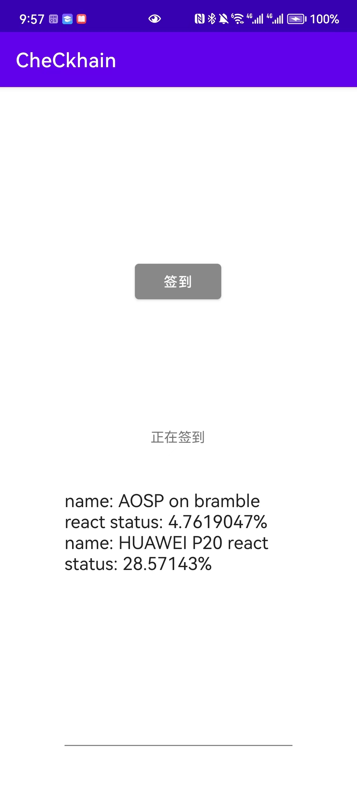

# 赛博课项目手机端（蓝牙连接细节）

## 界面与使用方式：

用户首先要授予“蓝牙”和“位置”（低功率蓝牙（BLE）中需要精确位置信息）权限，并连接网络（调用智能合约用）

点击“签到”

等待提示文字由“正在签到”变成“已签到”

界面下方会看到和其它签到者“协同签到”的进度

## 技术细节

手机端除了提供一个用户界面外，最重要的就是要提供一个能够证明签到者处于同一空间的可信硬件。

我们选择了低功率蓝牙（BLE）的广播功能，这将允许设备在50m内的范围内传出信息，并监听其它设备发来的信息。我们的总体设计让这个传播距离变得十分合适——用户必须到场，并且由于设备在场地的分布是分散的，所以不必担心在场而签不了到的情况，相当适用于教室或者聚集性活动的签到。

流程就是当用户点击签到时，设备蓝牙开始广播dual_message字符串信息，同时监听别的设备发来的信息。

使用这种方案的一个弊端是广播包的大小只有31字节（数据报文段），除去必要的字段和让我们应用的广播包区别于环境中其它蓝牙广播而放置的UUID信息，可利用的自定义数据字段只有14字节。所以我们把需要传递给其它设备的信息分段并编号，逐次循环广播，当某个设备集齐了另一台设备发送的完整信息后，进行验证。

我们认为，在人数较多的情形下，采用这种发很多广播包的方式（即便对接收者来说丢包再正常不过）是优于建立正式蓝牙连接再传输数据的（建立连接和断开同样需要较长时间），因为这样能够更快形成完备的网络（互联性好）。

虽然这个弊端让签到速度慢了一些，但也要求那些连教室门都不想进的同学起码得在门边上站一会儿才能签上到，某种意义上也算听了会儿课。

